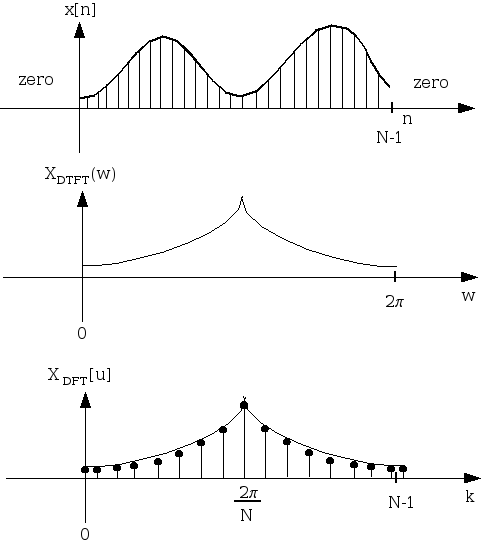
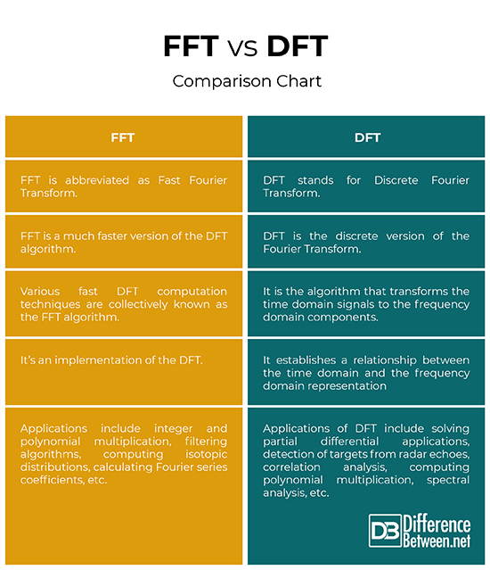

# Part 1: Introduce to DFT (Discrete Fourier Transform)
## From Z-Transform to DTFT
For array dicrete is \( x[n] \) với \( n = 0, 1, \ldots, N-1 \), Z-Transform define is:

\[ X[z] = \sum_{n= -\infty }^{+\infty} x[n] \cdot z^{-n}, \quad k = 0, 1, \ldots, N-1          | (1)\] 

with \( z = A \cdot e^{j \theta} = A \cdot (\cos(\theta) + j\cdot \ sin(\theta)) \) 

Replace \( z = A \cdot e^{j \cdot \theta} \) with \(r = 1 \)

Formula (1) becomes:
        \[ X[z] = \sum_{n= -\infty }^{+\infty} x[n] \cdot e^{-jwn}, \quad k = 0, 1, \ldots, N-1          | (2)\] 

## From DTFT to DFT

Visualization by image:



Chuẩn hóa tọa độ \(\frac{2 \pi \cdot k}{N}    \) với N điểm [0 đến N-1] theo biến k
 

With \( w =  \frac{2 \pi \cdot k}{N}  \)
=> From formula (2) becomes: (DFT)
        \[ X[k] = \sum_{n= 0 }^{N-1} x[n] \cdot e^{-j\frac{2 \pi \cdot k \cdot n}{N}}, \quad k = 0, 1, \ldots, N-1          | (3) \]
With DTFT:
* Input: discrete, infinite 
* Output: contine, periodic 
* Periodicty: The DTFT is periodic with period of \( 2 \pi\) in the frequency domain.

With DFT:
* Input: discrete, finite
* Output: dicrete, finite
* Periodicty: The DFT is periodic with a period of N in the frequency domain.

Take N sample. 


## Define DFT covert domain time to domain frequency

Cho dãy tín hiệu rời rạc \( x[n] \) với \( n = 0, 1, \ldots, N-1 \), DFT được định nghĩa là:

\[  X[k] = \sum_{n= 0 }^{N-1} x[n] \cdot e^{-j\frac{2 \pi \cdot k \cdot n}{N}}, \quad k = 0, 1, \ldots, N-1          | (3) \]

## Define IDFT (Inverse Dicrete Fourier Transform) covert domain freuency to domain time

\[ X[n] =  \frac{1}{N} \sum_{n= 0 }^{N-1} X[k]] \cdot e^{j\frac{2 \pi \cdot k \cdot n}{N}}, \quad k = 0, 1, \ldots, N-1          | (4) \]

## Drawback DFT

In code DFT has complexity \( O(n^2) \)

The DFT can process sequences of any size efficiently but is slower than the FFT and requires more memory, because it saves intermediate results while processing

## Application


## Code for example by C++

# Part 2: Introduce to FFT (Fourier Transform)

## Define FFT

FFT is calculation faster and efficient DFT:  
* In code use butterfly algorithms: 
* Butterfiler algorithms define:
    
- Reduce complexity from \( \mathcal{O}(N^2) \) to \( \mathcal{O}(N \log N) \).

* We next break the DFT into two parts: oven parts and odd parts to apply the butterfly algorithms 
## FFT Fourier formula

Formula Radix-2 FFT (Cooley-Tukey)

\[
X[k] = X_{\text{even}}[k] + W_N^k \cdot X_{\text{odd}}[k]
\]

\[
X[k + N/2] = X_{\text{even}}[k] - W_N^k \cdot X_{\text{odd}}[k], \quad k = 0, 1, \ldots, \frac{N}{2}-1
\]

While:
- \( X_{\text{even}}[k] \) is FFT of oven sample \( x[0], x[2], \ldots \),x[2n] with \( n = 1 \ldots \frac{n}{2} - 1 \)
- \( X_{\text{odd}}[k] \) is FFT of odd sample \( x[1], x[3], \ldots \),x[2n + 1] with \( n = 1 \ldots \frac{n}{2} - 1\)
- \( W_N^k = e^{-j\frac{2\pi}{N}k} \)

## Aplication for OFDM in telemunication
Folowing [PERFORMANCE OF ORTHOGONAL FREQUENCY DIVISION 
MULTIPLEXING (OFDM) UNDER THE EFFECT OF WIRELESS 
TRANSMISSION SYSTEM DRAWBACKS](https://www.bing.com/search?q=PERFORMANCE+OF+ORTHOGONAL+FREQUENCY+DIVISION+MULTIPLEXING+(OFDM)+UNDER+THE+EFFECT+OF+WIRELESS+TRANSMISSION+SYSTEM+DRAWBACKS&gs_lcrp=EgRlZGdlKgYIABBFGDkyBggAEEUYOagCALACAA&FORM=ANCMS9&PC=U531)
In 1971, Weinstein [2] introduced the idea of using a Discrete Fourier Transform (DFT) for the generation and reception of OFDM signals, eliminating the need for banks of analog subcarrier oscillators.
This presented an opportunity for an easier implementation of OFDM, especially through the use of Fast Fourier Transforms (FFT), which are an efficient implementation of the DFT.
It suggested that the simplest way to implement OFDM was through Digital Signal Processing (DSP), which can execute FFT algorithms.
Only recently have advances in integrated circuit technology made the implementation of OFDM cost-effective.
The reliance on DSP had previously prevented the widespread use of OFDM during its early development.

Translate to vietname 

```
Vào năm 1971, Weinstein [2] đã giới thiệu ý tưởng sử dụng Biến đổi Fourier Rời rạc (DFT) để tạo và thu tín hiệu OFDM, qua đó loại bỏ nhu cầu sử dụng các bộ dao động sóng mang con tương tự. Điều này mở ra cơ hội cho việc triển khai OFDM một cách dễ dàng, đặc biệt là với việc sử dụng Biến đổi Fourier Nhanh (FFT), vốn là cách thực hiện hiệu quả của DFT. Điều này cho thấy rằng phương pháp dễ dàng nhất để triển khai OFDM là sử dụng Xử lý Tín hiệu Số (DSP), vốn có khả năng thực hiện các thuật toán FFT.

Chỉ trong thời gian gần đây, những tiến bộ trong công nghệ vi mạch tích hợp mới khiến cho việc triển khai OFDM trở nên hiệu quả về mặt chi phí. Sự phụ thuộc vào DSP đã từng là rào cản khiến OFDM không được sử dụng rộng rãi trong giai đoạn phát triển ban đầu
```
OFDM architecture:

Intercell Interference: Orthogonality among the subcarriers not only helps in preventing Inter-Symbol Interference (ISI) from multiple copies of the same signal but also helps in avoiding interference among transmissions from neighbouring cells. [Giao thoa Intercell: Tính trực giao giữa các sóng mang con không chỉ giúp ngăn ngừa nhiễu liên ký (ISI) khỏi nhiều bản sao của cùng một tín hiệu mà còn giúp tránh sự can thiệp giữa các truyền từ các tế bào lân cận.] x


## Code for example by C++

## Compare DFT and FFT

From aplication [newton4th](https://www.newtons4th.com/media/docs/D000127-APP030-DFT-or-FFT-A-Comparison-of-Fourier-Transform-Techniques.pdf)

Trong phân tích dưới đây, FFT 1024 điểm đã được lấy mẫu ở mức 10ks/s trên dạng sóng 100VPK, 25Hz. Do tính chất của FFT và hạn chế của nó đối với các mẫu \( 2^n \), theo tốc độ mẫu này (cung cấp băng thông đo 5KHz - Định lý của Nyquist), rõ ràng là cửa sổ thu thập dữ liệu không bao gồm số lượng mẫu số nguyên, các mẫu không mong muốn bổ sung được hiển thị trong hộp màu đỏ trong Hình 4.

Băng thông đo là 5 kHz – theo Định lý của Nyquist
Như vậy, tần số lấy mẫu phải thoả mãn điều kiện fs ≥ 2fm. Tần số giới hạn fs/2 này được gọi là tần số Nyquist và khoảng (-fs/2; fs/2) gọi là khoảng Nyquist.

Vậy kết luận f Nyquist = fmax = fs/2


Trong khi FFT có vị trí của nó trong lĩnh vực kỹ thuật điện, để phân tích công suất chính xác cao, FFT không phải là giải pháp tối ưu. Một máy phân tích công suất cao sẽ cần phải đáp ứng các nhu cầu của ngành công nghiệp hiện đại, trong đó cần phải đo lường sự biến dạng của các tần số cơ bản khác nhau. Trách nhiệm của nhà sản xuất phân tích điện là tích hợp các bộ xử lý đủ mạnh và các kỹ thuật xử lý tín hiệu số sáng tạo để đáp ứng các nhu cầu tính toán của DFT. Tất cả các máy phân tích năng lượng N4L đã được phát triển với phương pháp này trong tâm trí và nhiều năm trải nghiệm điều chỉnh tinh chỉnh cả hiệu suất phần cứng tương tự và thuật toán xử lý tín hiệu DFT đã dẫn đến một giải pháp cực kỳ chính xác trong một loạt các dạng sóng đầu vào.

[betweendifrence](https://www.differencebetween.net/technology/difference-between-fft-and-dft/)


# Part 3: Proof from DFT to FFT (Fast Fourier Transform)

## Demonstrate  
Cho dãy tín hiệu rời rạc \( x[n] \) với \( n = 0, 1, \ldots, N-1 \), DFT được định nghĩa là:

\[ X[k] = \sum_{n= 0 }^{N-1} x[n] \cdot e^{-j\frac{2 \pi \cdot k \cdot n}{N}}, \quad k = 0, 1, \ldots, N-1          | (3) \]

Divide 2 part oven and oddd.
In case 1: k from 0 to N/2 - 1
\[ X[k] = \sum_{n= 0 }^{N/2 - 1} x[2n] \cdot e^{-j\frac{2 \pi \cdot k \cdot n}{N}} + \sum_{n= 0 }^{N/2 - 1} {x[2n + 1] \cdot e^{-j\frac{2 \pi \cdot k \cdot (2n + 1)}{N}}}, \quad k = 0, 1, \ldots, N/2-1 \] 

\[ X[k] = \sum_{n= 0 }^{N/2 - 1} x[2n] \cdot e^{-j\frac{2 \pi \cdot k \cdot n}{N}} + e^{-j\frac{2 \pi \cdot k }{N}} \cdot \sum_{n= 0 }^{N/2 - 1} {x[2n + 1] \cdot e^{-j\frac{2 \pi \cdot k \cdot (2n)}{N}}}, \quad k = 0, 1, \ldots, N/2-1 \]

At \( W_N^{nk} = e^{-j \frac{2\pi nk}{N}}\)

Becomes to:

 \[ X[k] = \sum_{n= 0 }^{N/2 - 1} x[2n] \cdot e^{-j\frac{2 \pi \cdot k \cdot 2n}{N}} + e^{-j\frac{2 \pi \cdot k }{N}} \cdot \sum_{n= 0 }^{N/2 - 1} {x[2n + 1] \cdot e^{-j\frac{2 \pi \cdot k \cdot (2n)}{N}}}, \quad k = 0, 1, \ldots, N/2-1 \]

  \[ X[k] = \sum_{n= 0 }^{N/2 - 1} x[2n] \cdot W_\frac{N}{2}^{nk} +  W_N^{k} \cdot \sum_{n= 0 }^{N/2 - 1} {x[2n + 1] \cdot W_\frac{N}{2}^{nk}}, \quad k = 0, 1, \ldots, N/2-1 \]

  \[ X[k] = X_even(k) + W_N^{k} \cdot X_odd(k) \]

In case 2: k1 = k + N/2 from N/2 to N - 1

Similar incase 1:

\[ X[k] = \sum_{n= 0 }^{N/2 - 1} x[2n] \cdot e^{-j\frac{2 \pi \cdot (k + N/2) \cdot 2n}{N}} + \sum_{n= 0 }^{N/2 - 1} {x[2n + 1] \cdot e^{-j\frac{2 \pi \cdot (k + N/2) \cdot (2n + 1)}{N}}}, \quad ((k + N/2) + N/2) = N/2, \ldots, N-1 \]

 \[ X[k] = \sum_{n= 0 }^{N/2 - 1} x[2n] \cdot e^{-j\frac{2 \pi \cdot (k) \cdot 2n}{N}} \cdot e^{-j\frac{2 \pi \cdot (n) \cdot N}{N }}  +  e^{-j\frac{2 \pi \cdot (k + N/2) }{N}} \cdot \sum_{n= 0 }^{N/2 - 1} {x[2n + 1] \cdot e^{-j\frac{2 \pi \cdot (k + N/2) \cdot (2n)}{N}}}, \quad (k + N/2) + N/2 = N/2, \ldots, N-1 \]

 \[ X[k] = \sum_{n= 0 }^{N/2 - 1} x[2n] \cdot e^{-j\frac{2 \pi \cdot (k) \cdot 2n}{N}} \cdot e^{-j\frac{2 \pi \cdot (n) \cdot N}{N }}  +  e^{-j\frac{2 \pi \cdot (k + N/2) }{N}} \cdot \sum_{n= 0 }^{N/2 - 1} {x[2n + 1] \cdot e^{-j\frac{2 \pi \cdot (k + N/2) \cdot (2n)}{N}}}, \quad (k + N/2) + N/2 = N/2, \ldots, N-1 \]

 \[ X[k] = \sum_{n= 0 }^{N/2 - 1} x[2n] \cdot e^{-j\frac{2 \pi \cdot (k) \cdot 2n}{N}} \cdot e^{-j\frac{2 \pi \cdot (n) \cdot N}{N }}  - e^{-j\frac{2 \pi \cdot (k) }{N}} \cdot \sum_{n= 0 }^{N/2 - 1} {x[2n + 1] \cdot e^{-j\frac{2 \pi \cdot (k) \cdot (2n)}{N}}} \cdot e^{-j\frac{2 \pi \cdot (N) \cdot (n)}{N}}, \quad (k + N/2) + N/2 = N/2, \ldots, N-1 \]


\( e^{-j\frac{2 \pi \cdot (N/2) }{N}} = e^{-j \cdot \pi} = cos(-\pi \cdot ) + jsin(-\pi) = -1\)

\( e^{-j\frac{2 \pi \cdot (n) \cdot N}{N }} = e^{-j \cdot 2 \pi \cdot n}= cos(-2 \pi \cdot n) + jsin(2 \pi \cdot n) =1  \)

  \[ X[k] = X_even(k) - W_N^{k} \cdot X_odd(k) \]


