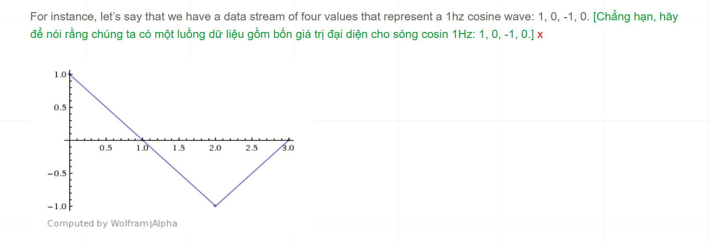

DFT (Discrete Fourier Transform)

Hiểu theo code:
https://blog.demofox.org/2016/08/11/understanding-the-discrete-fourier-transform/

Blog này cố mô phỏng các mà fourier thực tế bằng các ví dụ thực tế nhất do anh ấy nhìn thấy được. Từ những ví dụ cơ bản

Theo tôi hiểu anh ấy có một sóng ban đầu 

If you had a stream of data that had a single frequency in it at a constant amplitude, and you wanted to know the amplitude of that frequency, how could you figure that out? 
Nếu bạn có một luồng dữ liệu chỉ chứa một tần số duy nhất với biên độ không đổi, và bạn muốn biết biên độ của tần số đó, thì bạn có thể xác định nó bằng cách nào?

Giải thiết của ấy là một luồng dữ liệu thực tế số thực có cùng một tần số. Nhưng nó có cùng một tần số nhưng biên độ của nó thì chưa thể tìm được do đó anh ấy muốn tìm nó anh sẽ nhân luồng dữ liệu đó với sóng sin và cos anh ấy nhận thấy nhân cả nó với cả sóng sin và cả cos mới cho ra biên độ chính xác. 

We get.. 1*1 + 0*0 + -1*-1 + 0*0 = 2.

The result we get is 2, which is twice the amplitude of the data points we had. We can divide by two to get the real amplitude. [Kết quả chúng tôi nhận được là 2, gấp đôi biên độ của các điểm dữ liệu chúng tôi có. Chúng ta có thể chia cho hai để có được biên độ thực.] x

To show that this works for any amplitude, here’s the same 1hz cosine wave data with an amplitude of five: 5, 0, -5, 0. [Để chỉ ra rằng điều này hoạt động cho bất kỳ biên độ nào, ở đây, cùng một dữ liệu sóng cosin 1Hz với biên độ năm: 5, 0, -5, 0.] x

Multiplying by the 1hz cosine wave, we get… 5*1 + 0*0 + -5*-1 + 0*0 = 10.

The actual amplitude is 5, so we can see that our result was still twice the amplitude. [Biên độ thực tế là 5, vì vậy chúng ta có thể thấy rằng kết quả của chúng ta vẫn còn gấp đôi biên độ.] x

In general, you will need to divide by N / 2 where N is the number of samples you have. [Nói chung, bạn sẽ cần phải chia cho n / 2 trong đó n là số mẫu bạn có.] x

What happens if our stream of data has something other than a cosine wave in it though? [Điều gì xảy ra nếu luồng dữ liệu của chúng tôi có một cái gì đó không phải là sóng cosin trong đó?] x

Let’s try a sine wave: 0, 1, 0, -1

When we multiply those values by our cosine wave values we get: 0*1 + 1*0 + 0*-1 + -1*0 = 0. [Khi chúng ta nhân các giá trị đó với các giá trị sóng cosin của chúng ta, chúng ta nhận được: 0*1 + 1*0 + 0*-1 + -1*0 = 0.] x

We got zero. Our method broke! [Chúng tôi không có. Phương pháp của chúng tôi đã phá vỡ!] x

In this case, if instead of multiplying by cosine, we multiply by sine, we get what we expect: 0*0 + 1*1 + 0*0 + -1*-1 = 2. We get results consistent with before, where our answer is the amplitude times two. [Trong trường hợp này, nếu thay vì nhân với cosin, chúng ta nhân với hình sin, chúng ta sẽ nhận được những gì chúng ta mong đợi: 0*0 + 1*1 + 0*0 + -1*-1 = 2. Chúng ta nhận được kết quả phù hợp với trước đó, trong đó câu trả lời của chúng ta là biên độ hai lần.] x

That’s not very useful if we have to know whether we are looking for a sine or cosine wave though. We might even have some other type of wave that is neither one! [Điều đó không hữu ích lắm nếu chúng ta phải biết liệu chúng ta đang tìm kiếm một sóng hình sin hay cosin. Chúng tôi thậm chí có thể có một số loại sóng khác không phải là một!] x

The solution to this problem is actually to multiply the data points by both cosine and sine waves, and keep both results. [Giải pháp cho vấn đề này thực sự là nhân các điểm dữ liệu với cả sóng cosine và sin, và giữ cả hai kết quả.] x

Let’s see how that works.

For this example We’ll take a cosine wave and shift it 0.25 radians to give us samples: 0.97, -0.25, -0.97, 0.25. (The formula is cos(x*2*pi/4+0.25) from 0 to 3) [Trong ví dụ này, chúng tôi sẽ lấy một sóng cosin và thay đổi 0,25 radian để cung cấp cho chúng tôi các mẫu: 0,97, -0,25, -0,97, 0,25. (Công thức là cos (x*2*pi/4+0,25) từ 0 đến 3)] x

Cuối cùng, chúng ta nhân với n/N. Trong tổng của chúng ta, n là biến chỉ số và nó chạy từ 0 đến N-1. Điều này rất giống với một vòng lặp for. n/N đại diện cho phần trăm tiến trình hiện tại trong vòng lặp, vì vậy khi chúng ta nhân với n/N, tức là chúng ta đang lấy mẫu tại một vị trí khác (theo phần trăm tiến trình) trên các sóng cosin và sin tương ứng với các tần số đã chỉ định.

